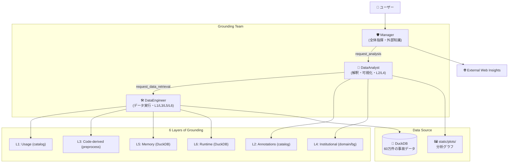

# 🚗 Traffic Safety Analyst

**接地（Grounding）されたコンテキストに基づく、交通事故統計の自己学習型データエージェント。**

警察庁の交通事故統計オープンデータ（2020年・2024年、計60万件超）を対象に、OpenAIが提唱する「6層の接地されたコンテキスト（6 layers of grounded context）」の思想を実装したPoCプロジェクトです。

## Why This Project?

LLMが直接SQLを書いてデータを分析する際、多くの壁にぶつかります。スキーマの意図が不明、ドメイン固有の定義（「致死率」と「死亡率」の違い等）の欠如、統計的なバイアスの無視、および同じ間違いを繰り返すこと。

本プロジェクトは、**6層の接地（Grounding）**、**自己学習ループ**、および**マルチエージェント構成**を用いることで、単なる数値の抽出を超えた、意味のあるインサイトの提供を目指します。

## アーキテクチャの設計思想：なぜ「マルチエージェント」なのか？

本プロジェクトは OpenAI の「6 layers of grounded context」を基盤としていますが、実装においては OpenAI が推奨する「単一の強力なエージェント」ではなく、あえて **「マルチエージェント構成」** を採用しています。

### 1. 複雑性の管理（Divide and Conquer）
OpenAI の理想とする単一エージェント構成は、モデルが 6 層すべてのコンテキストを一度に完璧に処理できることを前提としています。しかし、現在の LLM（Gemini 2.5 Flash / GPT-4o 等）では、一度に渡す指示や考慮事項が多すぎると、重要なステップ（グラフの生成、特定レイヤーのチェック、SQL の厳密さ）を飛ばしてしまう「注意力の散漫」が発生しやすくなります。

本プロジェクトでは役割を 3 人に分けることで、各エージェントの関心を限定し、高い精度と安定性を確保しています。

- **Manager**: 外部検索と全体構成（メタ認知）
- **Analyst**: ドメイン知識と解釈・可視化（統計的整合性）
- **Engineer**: SQL 実行とスキーマ・過去知見の管理（技術的整合性）

### 2. 接地の具体化（Manual context vs RAG）
OpenAI のインハウスエージェントは、膨大な社内データから RAG（ベクトル検索）で情報を動的に取得しますが、本プロジェクトでは以下の理由から、あえて 6 層の情報を明示的にツールや YAML でエージェントに提供しています。

- **情報の確実性**: 交通安全分析のようなドメインでは、定義（Layer 2）のわずかな違いが誤った結論に直結します。検索による「漏れ」のリスクを避け、必要なコンテキストを確実に「接地」させるための設計です。
- **デバッグ可能性**: どのエージェントがどのコンテキストを参照して判断したのかを、`st.status` を通じてユーザーがリアルタイムで追跡できます。

### 3. 接地のアプローチ：手動キュレーション vs. RAG
OpenAI の原論文では大規模な RAG（検索）による情報の自動抽出が想定されていますが、本プロジェクト（PoC段階）ではあえて **「YAML による手動キュレーション」** を選択しています。

- **信頼性（High Fidelity）**: 交通統計のような専門性の高いドメインでは、定義のわずかな漏れが致命的な誤答に繋がります。小〜中規模のデータセットにおいては、検索（RAG）の不確実性を排除し、100% の情報を確実にプロンプトへ注入するアプローチが、分析の「質」を担保するために最も効果的です。
- **将来の展望（Scalability）**: テーブル数やドキュメントが膨大になった場合は、レイヤー 4（背景知識）や 5（過去の記憶）から順次 RAG へ移行するハイブリッド構成を想定しています。現状は「情報の確実な接地」を優先した設計となっています。

---

## アーキテクチャ：6層の接地（Grounding）



| 層 | 接地の目的 | 本プロジェクトでの実装 |
|:---|:---|:---|
| **1. Usage** | テーブルの使用状況・結合ルールの理解 | `catalog.yaml` の典型的なクエリパターン |
| **2. Annotations** | メトリクスの定義、ビジネス上の意味 | セマンティック・カタログ（致死率の計算式等） |
| **3. Code-derived** | データの由来、前処理ロジックの把握 | `preprocess.py` ソースコードの直接読解 |
| **4. Institutional** | 背景知識、ドメインの専門知 | `domain.yaml` / `background.yaml`（バイアス、法改正） |
| **5. Memory** | 過去の修正、成功パターンの再利用 | `query_learnings` テーブルへの知見蓄積 |
| **6. Runtime** | ライブデータの検証、エラー修復 | `run_runtime_context_query` によるスキーマ検証 |

---

## エージェント構成

役割の異なる3つのエージェントが連携する階層構造を採用しています。

1.  **Manager (🛡️ Manager)**:
    *   チーム全体の指揮と最終的な報告書の作成。
    *   ユーザーの意図を汲み取り、外部知識（External Web Insights）を統合して回答を補完します。
2.  **DataAnalyst (🧪 アナリスト)**:
    *   データの解釈・分析・可視化（Python）を担当。
    *   ドメイン知識（Layer 2 & 4）に基づき、数値の背景（法改正やバイアス等）を考慮したインサイトを提供し、グラフを生成します。
3.  **DataEngineer (🛠️ エンジニア)**:
    *   データ実行エンジン。
    *   SQL実行、スキーマ接地（Layer 1, 3, 6）、および過去の知見（Layer 5）の管理を担当し、正確な事実をチームに提供します。

---

## 技術スタック

- **OpenAI Agents SDK** — マルチエージェント・オーケストレーション
- **DuckDB** — ローカル分析用高速インメモリDB
- **Streamlit** — インタラクティブなユーザーインターフェース


---

## クイックスタート

### 1. セットアップ

```bash
# 依存関係のインストール
uv sync

# 環境変数の設定
cp .env.example .env
# .env を編集して API キーを設定
# 使用可能なモデル名は以下を参照：
# Gemini: https://ai.google.dev/gemini-api/docs/models?hl=ja
# OpenAI: https://platform.openai.com/docs/models
```

### 2. データの配置
`data/` ディレクトリに警察庁の CSV を配置してください（初回起動時に DuckDB へ自動変換されます）。
```
data/
  honhyo_2020.csv
  honhyo_2024.csv
```

### 3. 実行

**Streamlit UI (推奨):**
```bash
uv run python -m streamlit run app.py
```

**CLI デモ:**
```bash
uv run python run.py --query "2020年と2024年の死亡事故件数の変化を教えて"
```

## 質問例

- `サポカーと非サポカーの致死率を比較して、残存事故バイアスの観点から解釈してください`
- `電動キックボード（特定小型原動機付自転車）の事故傾向と、施行されたルールの関係を教えて`
- `このままのペースで2030年の政府目標（死者数1500人以下）は達成できるか試算して`

---

## Learn More
- [OpenAI's In-House Data Agent](https://openai.com/index/inside-our-in-house-data-agent/) — コンテキスト接地の着想元
