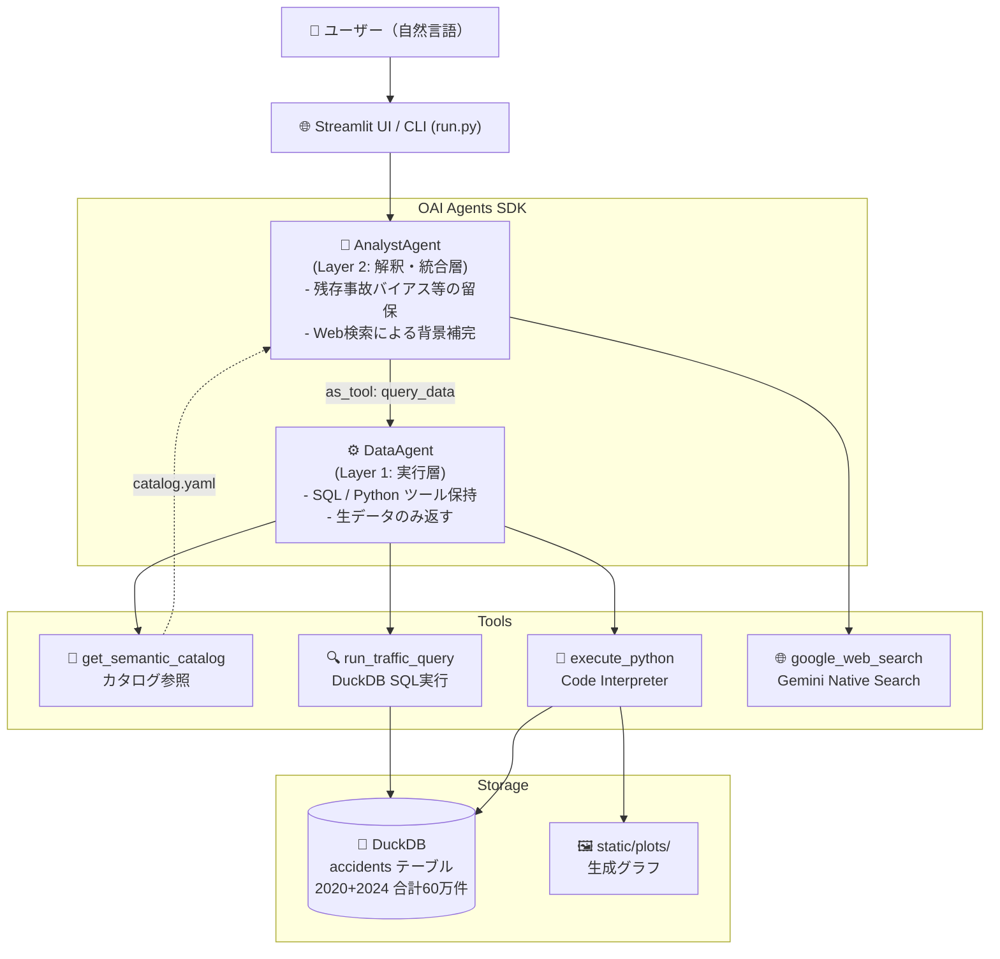

# AI Data Analytics Agents — 交通事故統計分析

警察庁の交通事故統計オープンデータ（2020年・2024年、計60万件超）を  
OAI Agents SDK のマルチエージェント構成で分析するデモプロジェクトです。

## アーキテクチャ



## OpenAI流：6層の接地（Grounded Context）構造

本プロジェクトは、OpenAI が自社データエージェントで採用している設計思想に基づき、以下の6つのレイヤーでエージェントの回答を「接地（Grounding）」させています。これにより、大規模かつ複雑なデータに対してもハルシネーションを最小化し、専門的な洞察を提供します。

| 層 | 名称 | 役割 |
|---|---|---|
| レイヤー #1 | **テーブルの使用状況** | スキーマメタデータに加え、過去のクエリ推論やテーブル系統（Lineage）を把握。 |
| レイヤー #2 | **人間による注釈** | ドメインエキスパートによる厳選された説明（意図、ビジネス上の意味、注意事項）。 |
| レイヤー #3 | **Codex エンリッチメント** | 前処理コード（`preprocess.py`）を読解し、値の一意性や除外ロジック等のコードレベルの定義を抽出。 |
| レイヤー #4 | **インスティテューショナルナレッジ** | 社内ドキュメント（`domain.yaml`, `background.yaml`）から、リリース情報やインシデント等の組織知を統合。 |
| レイヤー #5 | **メモリ** | 他のレイヤーからは推測が難しい「わかりにくい修正、フィルタ、制約」を学習・再利用。 |
| レイヤー #6 | **ランタイムコンテキスト** | DWHへのライブクエリによるスキーマ検証、データのリアルタイム把握、および自己修正。 |

※ 加えて、本 PoC では **Gemini Native Search** を Layer 6 の外部データ連携の一環として活用し、最新の社会情勢（2024年11月の法改正等）を補完しています。

AnalystAgent は DataAgent を `as_tool` で呼び出す。LLM同士が連携するマルチエージェント構成により、実行ロジックとドメイン知識を分離している。

## セットアップ

```bash
# 1. リポジトリをクローン
git clone <repo>
cd ai-data-analytics-agents

# 2. 依存関係のインストール
uv sync

# 3. 環境変数の設定
cp .env.example .env
# .env を編集して APIキーを設定
```

### 必要な環境変数（`.env`）

```
GEMINI_API_KEY=AIza...          # Gemini を使う場合（デフォルト）
OPENAI_API_KEY=sk-...           # GPT-4o を使う場合（省略可）
AGENT_MODEL=gemini-2.5-flash    # 使用するモデル（デフォルト）
```

### データの配置

`data/` ディレクトリに警察庁オープンデータの CSV を配置してください。

```
data/
  honhyo_2020.csv   # 2020年 交通事故本票
  honhyo_2024.csv   # 2024年 交通事故本票
```

データは [警察庁オープンデータ](https://www.npa.go.jp/publications/statistics/koutsuu/opendata/index_opendata.html) から取得できます。  
初回起動時に DuckDB（`data/traffic_safety.db`）へ自動変換されます。

## 実行方法

### Streamlit UI（推奨）

```bash
uv run streamlit run app.py
```

分析中の進捗（カタログ参照 → SQL実行 → Python実行 → グラフ生成）がリアルタイムに表示されます。

### CLI

```bash
uv run python run.py
# カスタムクエリ
uv run python run.py --query "サポカーと非サポカーの致死率を比較して"
```

## 質問例

- `2020年と2024年の死亡事故件数の変化を教えてください`
- `サポカーと非サポカーの致死率を比較して、残存事故バイアスの観点から解釈してください`
- `事故類型別（人対車両・車両相互・車両単独）の死亡事故件数を比較してグラフにして`
- `このままのペースで2030年の政府目標（死者数1500人以下）は達成できるか試算して`

## プロジェクト構成

```
.
├── app.py                  # Streamlit UI
├── run.py                  # CLI デモ
├── src/
│   ├── agent.py            # マルチエージェント構成（build_agents）
│   ├── tools.py            # function_tool 定義（SQL・Python・カタログ）
│   ├── preprocess.py       # CSV → DuckDB 変換
│   └── context/
│       └── catalog.yaml    # Layer 2 セマンティックカタログ
└── static/plots/           # 生成グラフの保存先
```

## 技術スタック

- **OAI Agents SDK** (`openai-agents==0.15.1`) — マルチエージェントオーケストレーション
- **DuckDB** — ローカル分析用インメモリDB
- **Gemini 2.5 Flash** — OpenAI互換エンドポイント経由
- **Streamlit** — UI
- **japanize-matplotlib** — 日本語ラベル付きグラフ生成
